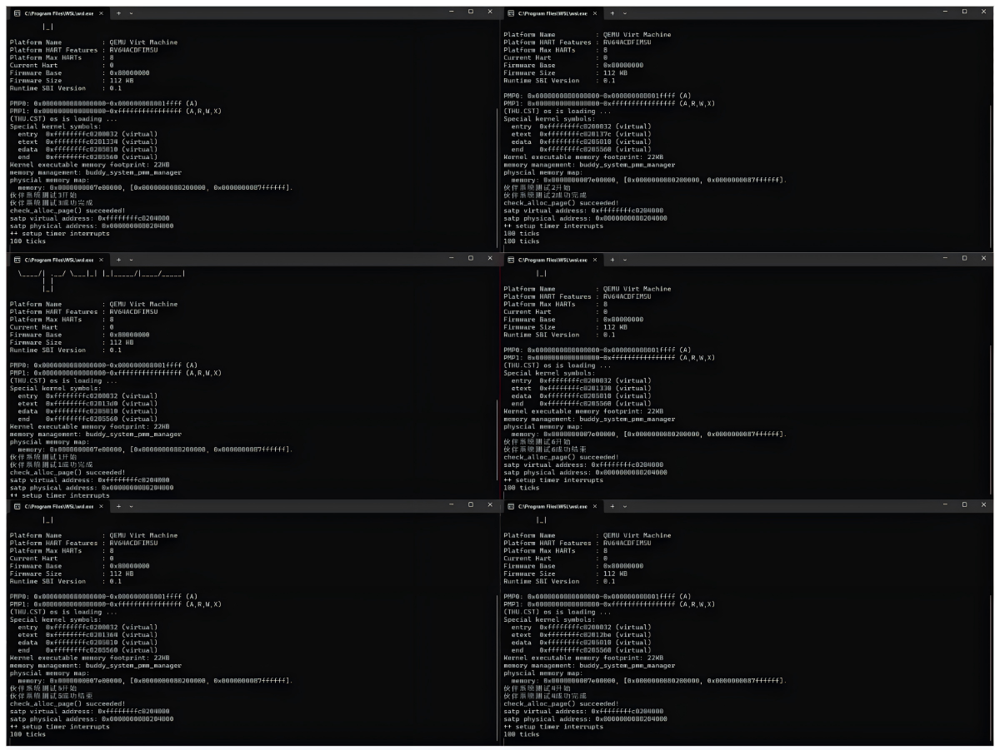
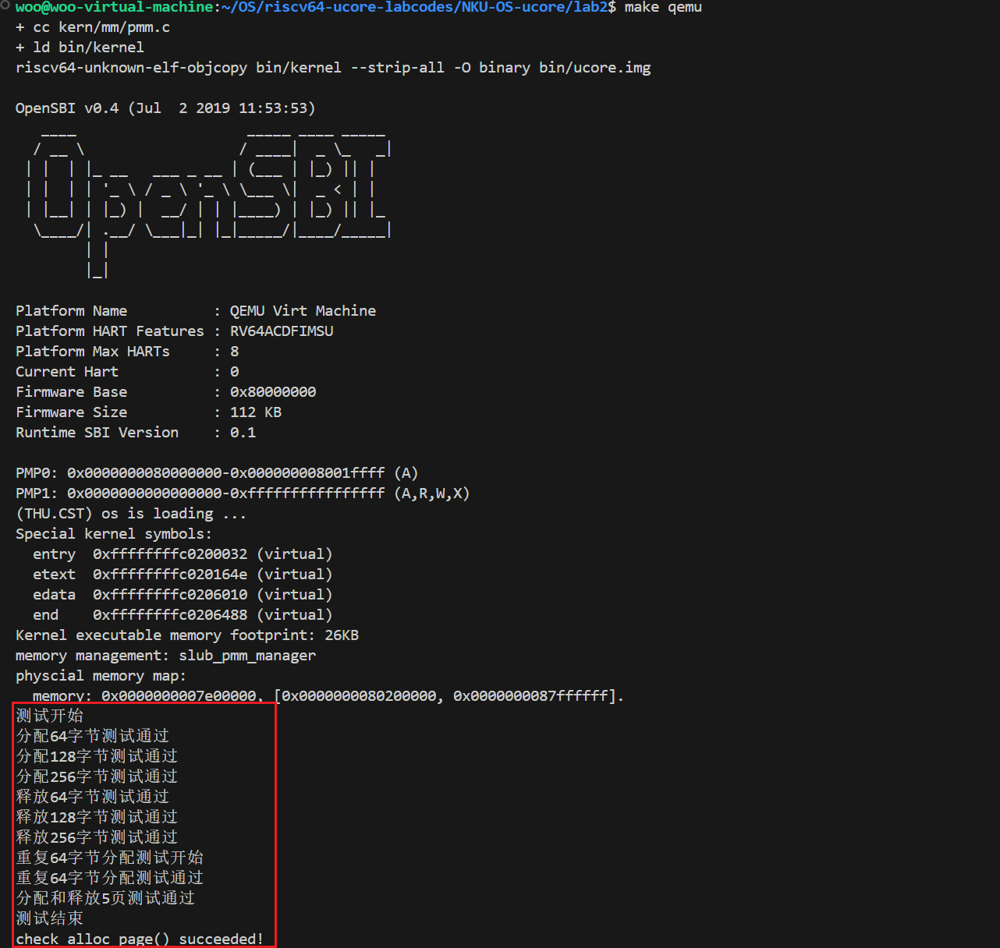

# Lab2实验报告
李欣龙 闫耀方 赵思洋
## 练习1：理解first-fit 连续物理内存分配算法（思考题）
>first-fit 连续物理内存分配算法作为物理内存分配一个很基础的方法，需要同学们理解它的实现过程。请大家仔细阅读实验手册的教程并结合`kern/mm/default_pmm.c`中的相关代码，认真分析default_init，default_init_memmap，default_alloc_pages， default_free_pages等相关函数，并描述程序在进行物理内存分配的过程以及各个函数的作用。 请在实验报告中简要说明你的设计实现过程。请回答如下问题：


### 1. `default_init`

```c
static void default_init(void) {
    list_init(&free_list);
    nr_free = 0;
}
```

`default_init` 函数用于初始化空闲内存块的链表和空闲页的总数：

- **`list_init(&free_list);`**：将 `free_list` 初始化为空的双向链表，用于记录所有空闲内存块。
- **`nr_free = 0;`**：将总空闲页数量 `nr_free` 设置为 0，初始状态没有任何可用的内存页。

此函数确保在开始分配内存之前，系统有一个空的链表和清零的统计值，方便后续管理空闲页。

### 2. `default_init_memmap`

```c
static void default_init_memmap(struct Page *base, size_t n) {
    assert(n > 0);
    struct Page *p = base;
    for (; p != base + n; p++) {
        assert(PageReserved(p));
        p->flags = p->property = 0;
        set_page_ref(p, 0);
    }
    base->property = n;
    SetPageProperty(base);
    nr_free += n;

    if (list_empty(&free_list)) {
        list_add(&free_list, &(base->page_link));
    } else {
        list_entry_t* le = &free_list;
        while ((le = list_next(le)) != &free_list) {
            struct Page* page = le2page(le, page_link);
            if (base < page) {
                list_add_before(le, &(base->page_link));
                break;
            } else if (list_next(le) == &free_list) {
                list_add(le, &(base->page_link));
            }
        }
    }
}
```

`default_init_memmap` 函数初始化一个连续的空闲内存块，设置该块中的页面状态并将其加入到 `free_list` 链表中：

- **页面初始化**：循环遍历该块中的每个页面 `p`，清除它们的标志位和属性（`p->flags = 0;`），重置引用计数。
- **设置块属性**：将该块的第一个页面（`base`）的 `property` 设置为整个块的页面数量 `n`，并设置 `PG_property` 标志，表示这是一个有效的空闲块。
- **更新总空闲页数**：将 `n` 加入 `nr_free` 中，更新系统中空闲页的总数。
- **按地址排序插入链表**：将 `base` 页面按地址顺序插入到 `free_list` 中，这样可以方便后续内存的释放和合并。

### 3. `default_alloc_pages`

```c
static struct Page *default_alloc_pages(size_t n) {
    assert(n > 0);
    if (n > nr_free) {
        return NULL;
    }
    struct Page *page = NULL;
    list_entry_t *le = &free_list;
    while ((le = list_next(le)) != &free_list) {
        struct Page *p = le2page(le, page_link);
        if (p->property >= n) {
            page = p;
            break;
        }
    }
    if (page != NULL) {
        list_entry_t* prev = list_prev(&(page->page_link));
        list_del(&(page->page_link));
        if (page->property > n) {
            struct Page *p = page + n;
            p->property = page->property - n;
            SetPageProperty(p);
            list_add(prev, &(p->page_link));
        }
        nr_free -= n;
        ClearPageProperty(page);
    }
    return page;
}
```

`default_alloc_pages` 函数从 `free_list` 中找到第一个满足请求大小 `n` 的空闲块并分配内存：

- **寻找空闲块**：通过遍历 `free_list` 中的每个块，找到第一个 `property >= n` 的块 `p`。
- **块分配**：如果找到合适的块 `p`：
  - 如果块大小 `property` 大于请求大小 `n`，则分割块：分配前 `n` 个页面给用户，剩余部分重新作为空闲块插入 `free_list`。
  - 更新 `nr_free` 减少分配的页面数。
  - 清除分配的块的 `PG_property` 标志，表示这部分不再是空闲块。

### 4. `default_free_pages`

```c
static void default_free_pages(struct Page *base, size_t n) {
    assert(n > 0);
    struct Page *p = base;
    for (; p != base + n; p++) {
        assert(!PageReserved(p) && !PageProperty(p));
        p->flags = 0;
        set_page_ref(p, 0);
    }
    base->property = n;
    SetPageProperty(base);
    nr_free += n;

    if (list_empty(&free_list)) {
        list_add(&free_list, &(base->page_link));
    } else {
        list_entry_t* le = &free_list;
        while ((le = list_next(le)) != &free_list) {
            struct Page* page = le2page(le, page_link);
            if (base < page) {
                list_add_before(le, &(base->page_link));
                break;
            } else if (list_next(le) == &free_list) {
                list_add(le, &(base->page_link));
            }
        }
    }

    list_entry_t* le = list_prev(&(base->page_link));
    if (le != &free_list) {
        p = le2page(le, page_link);
        if (p + p->property == base) {
            p->property += base->property;
            ClearPageProperty(base);
            list_del(&(base->page_link));
            base = p;
        }
    }

    le = list_next(&(base->page_link));
    if (le != &free_list) {
        p = le2page(le, page_link);
        if (base + base->property == p) {
            base->property += p->property;
            ClearPageProperty(p);
            list_del(&(p->page_link));
        }
    }
}
```

`default_free_pages` 函数释放内存，将 `n` 个页面插入到 `free_list` 中并合并相邻空闲块：

- **重置页面属性**：遍历 `base` 到 `base + n` 的页面，将它们的标志位和引用计数重置，并设置 `base` 的 `property` 为 `n`。
- **插入链表**：将 `base` 按地址顺序插入 `free_list`。
- **合并块**：检查 `base` 前后的块是否为空闲块，如果是，则进行合并，并更新合并后的 `property` 值。

### 5. `default_nr_free_pages`

```c
static size_t default_nr_free_pages(void) {
    return nr_free;
}
```

`default_nr_free_pages` 函数返回当前系统中空闲页面的总数，即 `nr_free` 的值。

>这些函数协同工作，实现了 `first-fit` 分配算法的基本流程，从而有效管理内存的分配和回收。下面请回答如下问题：
>- 你的first fit算法是否有进一步的改进空间？

1. 短期优化：可以立即通过按块大小排序的方式优化当前双向链表结构，这能显著提高查找效率，避免地址线性遍历的开销。
2. 长期优化：引入更复杂的数据结构如红黑树、跳表或分离空闲链表结构可以进一步提升内存分配和释放的效率。这些方法可以减少查找和插入空闲块时的时间复杂度，使得内存管理系统更高效、灵活。

## 练习2：实现 Best-Fit 连续物理内存分配算法（需要编程）
>在完成练习一后，参考kern/mm/default_pmm.c对First Fit算法的实现，编程实现Best Fit页面分配算法，算法的时空复杂度不做要求，能通过测试即可。 请在实验报告中简要说明你的设计实现过程，阐述代码是如何对物理内存进行分配和释放，并回答如下问题：


#### （1）`best_fit_init`函数
```c
static void
best_fit_init(void)
{
    list_init(&free_list);
    nr_free = 0;
}
```
- **功能**：
    - 初始化空闲链表`free_list`，使其成为一个空链表。
    - 将记录空闲页数量的变量`nr_free`初始化为0。
- **目的**：为后续的内存管理操作准备好初始的数据结构和状态。

#### （2）`best_fit_init_memmap`函数
```c
static void
best_fit_init_memmap(struct Page *base, size_t n)
{
    assert(n > 0);
    struct Page *p = base;
    for (; p!= base + n; p++)
    {
        assert(PageReserved(p));
        p->flags = p->property = 0;
        set_page_ref(p, 0);
    }
    base->property = n;
    SetPageProperty(base);
    nr_free += n;
    if (list_empty(&free_list))
    {
        list_add(&free_list, &(base->page_link));
    }
    else
    {
        list_entry_t *le = &free_list;
        while ((le = list_next(le))!= &free_list)
        {
            struct Page *page = le2page(le, page_link);
            if (base < page)
            {
                list_add_before(le, &(base->page_link));
                break;
            }
            else if (list_next(le) == &free_list)
            {
                list_add(le, &(base->page_link));
            }
        }
    }
}
```
- **功能**：
    - 首先，通过一个循环将从`base`开始的`n`个页的`flags`和`property`属性清零，并将它们的引用计数设为0。
    - 接着，将`base`页的`property`属性设置为`n`，并标记该页具有属性（通过`SetPageProperty(base)`，这里可能是设置一些与页属性相关的标志位）。
    - 然后，将空闲页数量`nr_free`增加`n`。
    - 最后，根据空闲链表`free_list`的状态将`base`页插入到链表中：
        - 如果链表为空，则直接将`base`页插入到链表中。
        - 如果链表不为空，则遍历链表，找到合适的位置（当`base`小于`page`时，将`base`插入到`page`之前；如果遍历到链表末尾，则将`base`插入到链表尾部）插入`base`页。
- **目的**：对给定的一段内存区域（从`base`开始的`n`个页）进行初始化，将其添加到空闲页链表中进行管理。

#### （3）`best_fit_alloc_pages`函数
```c
static struct Page *
best_fit_alloc_pages(size_t n)
{
    assert(n > 0);
    if (n > nr_free)
    {
        return NULL;
    }
    struct Page *page = NULL;
    list_entry_t *le = &free_list;
    size_t min_size = nr_free + 1;
    while ((le = list_next(le))!= &free_list)
    {
        struct Page *p = le2page(le, page_link);
        if (p->property >= n && p->property < min_size)
        {
            page = p;
            min_size = p->property;
        }
    }

    if (page!= NULL)
    {
        list_entry_t *prev = list_prev(&(page->page_link));
        list_del(&(page->page_link));
        if (page->property > n)
        {
            struct Page *p = page + n;
            p->property = page->property - n;
            SetPageProperty(p);
            list_add(prev, &(p->page_link));
        }
        nr_free -= n;
        ClearPageProperty(page);
    }
    return page;
}
```
- **功能**：
    - 首先检查请求的页数`n`是否大于空闲页数量`nr_free`，如果是，则直接返回`NULL`，表示无法分配内存。
    - 然后，遍历空闲链表`free_list`，寻找大小大于等于`n`且最接近`n`的空闲页块：
        - 初始化变量`min_size`为一个较大值（`nr_free + 1`），用于记录找到的最适合的空闲页块大小。
        - 在遍历过程中，当找到满足条件（`p->property >= n && p->property < min_size`）的页块时，更新`page`指针和`min_size`变量。
    - 如果找到了合适的页块（`page`不为`NULL`）：
        - 从链表中删除该页块。
        - 如果该页块的大小大于`n`，则将其分割：
            - 计算分割后剩余页块的起始地址`p = page + n`。
            - 设置剩余页块的大小`p->property = page->property - n`，并标记其具有属性（`SetPageProperty(p)`）。
            - 将剩余页块重新插入到空闲链表中。
        - 减少空闲页数量`nr_free`，并清除分配页块的属性标记（`ClearPageProperty(page)`）。
    - 最后返回分配的页块指针。
- **目的**：实现最佳适配的内存分配算法，从空闲页链表中找到最适合请求大小的空闲页块进行分配。

#### （4）`best_fit_free_pages`函数
```c
static void
best_fit_free_pages(struct Page *base, size_t n)
{
    assert(n > 0);
    struct Page *p = base;
    for (; p!= base + n; p++)
    {
        assert(!PageReserved(p) &&!PageProperty(p));
        p->flags = 0;
        set_page_ref(p, 0);
    }
    base->property = n;
    SetPageProperty(base);
    nr_free += n;

    if (list_empty(&free_list))
    {
        list_add(&free_list, &(base->page_link));
    }
    else
    {
        list_entry_t *le = &free_list;
        while ((le = list_next(le))!= &free_list)
        {
            struct Page *page = le2page(le, page_link);
            if (base < page)
            {
                list_add_before(le, &(base->page_link));
                break;
            }
            else if (list_next(le) == &free_list)
            {
                list_add(le, &(base->page_link));
            }
        }
    }

    list_entry_t *le = list_prev(&(base->page_link));
    if (le!= &free_list)
    {
        p = le2page(le, page_link);
        if (p + p->property == base)
        {
            p->property += base->property;
            ClearPageProperty(base);
            list_del(&(base->page_link));
            base = p;
        }
    }

    le = list_next(&(base->page_link));
    if (le!= &free_list)
    {
        p = le2page(le, page_link);
        if (base + base->property == p)
        {
            base->property += p->property;
            ClearPageProperty(p);
            list_del(&(p->page_link));
        }
    }
}
```
- **功能**：
    - 首先，通过循环将从`base`开始的`n`个页的`flags`设置为0，引用计数设为0，并检查这些页没有被保留且没有属性（通过`assert`语句）。
    - 接着，设置`base`页的`property`属性为`n`，并标记该页具有属性（`SetPageProperty(base)`），同时将空闲页数量`nr_free`增加`n`。
    - 然后，根据空闲链表`free_list`的状态将`base`页插入到链表中（插入逻辑与`best_fit_init_memmap`函数中的插入逻辑相同）。
    - 之后，检查`base`页前后的页是否是空闲且连续的：
        - 检查`base`页之前的页：
            - 获取`base`页前一个页块的指针`p`。
            - 如果`p`页块的末尾地址加上其大小等于`base`页的起始地址（`p + p->property == base`），则进行合并操作：
                - 更新`p`页块的大小`p->property += base->property`。
                - 清除`base`页的属性标记（`ClearPageProperty(base)`）。
                - 从链表中删除`base`页。
                - 将`base`指针更新为`p`，以便后续可能的连续合并检查。
        - 检查`base`页之后的页：
            - 获取`base`页后一个页块的指针`p`。
            - 如果`base`页的末尾地址加上其大小等于`p`页的起始地址（`base + base->property == p`），则进行合并操作：
                - 更新`base`页的大小`base->property += p->property`。
                - 清除`p`页的属性标记（`ClearPageProperty(p)`）。
                - 从链表中删除`p`页。
- **目的**：实现内存页的释放操作，将释放的页块添加到空闲链表中，并进行相邻空闲页块的合并操作。

#### （5）`best_fit_nr_free_pages`函数
```c
static size_t
best_fit_nr_free_pages(void)
{
    return nr_free;
}
```
- **功能**：简单地返回当前空闲页的数量`nr_free`。
- **目的**：提供一种查询当前空闲页数量的方法。

#### （6）`basic_check`函数
```c
static void
basic_check(void)
{
    struct Page *p0, *p1, *p2;
    p0 = p1 = p2 = NULL;
    assert((p0 = alloc_page())!= NULL);
    assert((p1 = alloc_page())!= NULL);
    assert((p2 = alloc_page())!= NULL);

    assert(p0!= p1 && p0!= p2 && p1!= p2);
    assert(page_ref(p0) == 0 && page_ref(p1) == 0 && page_ref(p2) == 0);

    assert(page2pa(p0) < npage * PGSIZE);
    assert(page2pa(p1) < npage * PGSIZE);
    assert(page2pa(p2) < npage * PGSIZE);

    list_entry_t free_list_store = free_list;
    list_init(&free_list);
    assert(list_empty(&free_list));

    unsigned int nr_free_store = nr_free;
    nr_free = 0;

    assert(alloc_page() == NULL);

    free_page(p0);
    free_page(p1);
    free_page(p2);
    assert(nr_free == 3);

    assert((p0 = alloc_page())!= NULL);
    assert((p1 = alloc_page())!= NULL);
    assert((p2 = alloc_page())!= NULL);

    assert(alloc_page() == NULL);

    free_page(p0);
    assert(!list_empty(&free_list));

    struct Page *p;
    assert((p = alloc_page()) == p0);
    assert(alloc_page() == NULL);

    assert(nr_free == 0);
    free_list = free_list_store;
    nr_free = nr_free_store;

    free_page(p);
    free_page(p1);
    free_page(p2);
}
```
- **功能**：
    - 进行一系列基本的内存分配和释放检查：
        - 首先，分配3个页（`p0`、`p1`、`p2`），并通过一系列`assert`语句检查：
            - 这3个页的指针互不相同。
            - 它们的引用计数都为0。
            - 它们的物理地址在合理范围内（小于`npage * PGSIZE`）。
        - 然后，保存当前的空闲链表和空闲页数量，重新初始化空闲链表并将空闲页数量设为0，检查此时分配页是否失败。
        - 接着，释放之前分配的3个页，检查空闲页数量是否变为3。
        - 再重新分配3个页，检查分配操作是否成功，然后再检查分配第4个页是否失败。
        - 之后，释放`p0`页，检查空闲链表是否不为空。
        - 再从链表中分配一个页，检查分配的页是否为`p0`，以及再次分配页是否失败。
        - 最后，恢复原始的空闲链表和空闲页数量，并释放所有页。
- **目的**：对内存分配和释放的基本功能进行全面的测试和验证，确保在简单场景下内存管理操作的正确性。

#### （7）`best_fit_check`函数
```c
static void
best_fit_check(void)
{
    int score = 0, sumscore = 6;
    int count = 0, total = 0;
    list_entry_t *le = &free_list;
    while ((le = list_next(le))!= &free_list)
    {
        struct Page *p = le2page(le, page_link);
        assert(PageProperty(p));
        count++, total += p->property;
    }
    assert(total == nr_free_pages());

    basic_check();

#ifdef ucore_test
    score += 1;
    cprintf("grading: %d / %d points\n", score, sumscore);
#endif
    struct Page *p0 = alloc_pages(5), *p1, *p2;
    assert(p0!= NULL);
    assert(!PageProperty(p0));

#ifdef ucore_test
    score += 1;
    cprintf("grading: %d / %d points\n", score, sumscore);
#endif
    list_entry_t free_list_store = free_list;
    list_init(&free_list);
    assert(list_empty(&free_list));
    assert(alloc_page() == NULL);

#ifdef ucore_test
    score += 1;
    cprintf("grading: %d / %d points\n", score, sumscore);
#endif
    unsigned int nr_free_store = nr_free;
    nr_free = 0;

    // * - - * -
    free_pages(p0 + 1, 2);
    free_pages(p0 + 4, 1);
    assert(alloc_pages(4) == NULL);
    assert(PageProperty(p0 + 1) && p0[1].property == 2);
    // * - - * *
    assert((p1 = alloc_pages(1))!= NULL);
    assert(alloc_pages(2)!= NULL); // best fit feature
    assert(p0 + 4 == p1);

#ifdef ucore_test
    score += 1;
    cprintf("grading: %d / %d points\n", score, sumscore);
#endif
    p2 = p0 + 1;
    free_pages(p0, 5);
    assert((p0 = alloc_pages(5))!= NULL);
    assert(alloc_page() == NULL);

#ifdef ucore_test
    score += 1;
    cprintf("grading: %d / %d points\n", score, sumscore);
#endif
    assert(nr_free == 0);
    nr_free = nr_free_store;

    free_list = free_list_store;
    free_pages(p0, 5);

    le = &free_list;
    while ((le = list_next(le))!= &free_list)
    {
        struct Page *p = le2page(le, page_link);
        count--, total -= p->property;
    }
    assert(count == 0);
    assert(total == 0);
#ifdef ucore_test
    score += 1;
    cprintf("grading: %d / %d points\n", score, sumscore);
#endif
}
```
- **功能**：
    - 首先，通过遍历空闲链表检查空闲页的属性和总大小：
        - 计算空闲页的数量`count`和总大小`total`。
        - 通过`assert`语句检查总大小是否等于通过`nr_free_pages()`函数获取的空闲页数量（这里`nr_free_pages()`可能是一个获取空闲页总大小的函数，在代码中未给出，但根据上下文推测与`nr_free`相关）。
    - 然后，调用`basic_check`函数进行基本的内存管理检查。
    - 接着，进行一系列复杂的内存分配和释放操作检查：
        - 分配5个页给`p0`，并检查分配成功且`p0`没有特定属性（`!PageProperty(p0)`）。
        - 保存空闲链表和空闲页数量，重新初始化空闲链表和空闲页数量，检查此时分配页是否失败。
        - 释放`p0`中的部分页（`p0 + 1`的2页和`p0 + 4`的1页），检查分配4页是否失败，以及释放


#### best fit算法测试结果如下所示：


>- 你的 Best-Fit 算法是否有进一步的改进空间？

1. 使用二级或多级分配策略。为了提高内存分配的效率，可以采用二级或多级分配策略。在此策略中，首先根据请求的内存大小选择一个合适的块，如果没有合适的块，则分配一个更大的块并将其拆分为多个小块，以适应不同的请求。这种方法可以减少小块的合并和碎片化问题。
2. 合并空闲块的策略优化。在释放内存时，当前的实现可能需要遍历整个空闲链表来找到可以合并的块。可以考虑在分配时维护一个合并列表，只记录相邻的空闲块，减少查找时间。
3. 使用更高效的数据结构，比如平衡树，哈希表等来维持空闲块的大小，这样在分配时可以快速定位最合适的空闲块，避免每次分配时都要遍历整个链表。

## 扩展练习Challenge：buddy system（伙伴系统）分配算法（需要编程）
>Buddy System算法把系统中的可用存储空间划分为存储块(Block)来进行管理, 每个存储块的大小必须是2的n次幂(Pow(2, n)), 即1, 2, 4, 8, 16, 32, 64, 128...
> - 参考[伙伴分配器的一个极简实现](http://coolshell.cn/articles/10427.html)， 在ucore中实现buddy system分配算法，要求有比较充分的测试用例说明实现的正确性，需要有设计文档。


### 一、概述
Buddy System算法把系统中的可用存储空间划分为存储块(Block)来进行管理，每个存储块的大小必须是2的n次幂(Pow(2, n))，即1, 2, 4, 8, 16, 32, 64, 128...

在实现伙伴系统分配算法之前，首先回顾一下伙伴系统的基本概念。伙伴系统分配算法通过将内存按2的幂进行划分，以便于高效管理内存的分配与释放。该算法利用空闲链表来维护不同大小的空闲内存块，能够快速查找合适大小的块，且在合并时能够减少外部碎片。尽管其优点明显，但也存在内部碎片的问题，尤其在请求大小不是2的幂次方时。

### 二、设计思路

#### （一）内存分区管理
整个可分配的分区大小为N，请求的分区大小为n，当n < N时，将N分配给进程。
按2的幂划分空闲块，直至找到合适大小的空闲块。

#### （二）合并条件
1. 相同大小且为2的整数次幂。
2. 地址相邻。
3. 低地址空闲块的起始地址为块大小的整数次幂的位数。

#### （三）空闲页初始化部分：按照伙伴系统的规则划分成合适大小的块，并将这些块添加到对应的空闲块链表中进行管理。按照order从大到小顺序在物理内存base处，通过找到合适的块大小对应的幂次（order）来完成这一操作。
```c
static void buddy_init_memmap(struct Page *base, size_t n)
{
    assert(n > 0);
    int order = MAX_ORDER;
    while ((1 << order) > n)
    {
        order--;
    }
    list_add(&free_area[order].free_list, &(base->page_link));
    base->property = (1 << order);
    SetPageProperty(base);
    free_area[order].nr_free++;
}
```

#### （四）页分配：order从从当前页大小到大查找，通过地址偏移量二进制位运算，计算拆分得到伙伴地址page + (1 << current_order)，
```c
static struct Page *buddy_alloc_pages(size_t n)
{
    int order = 0;
    while ((1 << order) < n)
    {
        order++;
    }
    if (order > MAX_ORDER)
        return NULL; // 请求的块超出最大支持块的大小

    // 查找适合的块
    for (int current_order = order; current_order <= MAX_ORDER; current_order++)
    {
        if (!list_empty(&free_area[current_order].free_list))
        {
            list_entry_t *le = list_next(&free_area[current_order].free_list);
            struct Page *page = le2page(le, page_link);
            list_del(le); // 从空闲列表中删除
            free_area[current_order].nr_free--;

            // 拆分较大的块，直到我们找到合适的大小
            while (current_order > order)
            {
                current_order--;
                struct Page *buddy = page + (1 << current_order);
                buddy->property = (1 << current_order);
                SetPageProperty(buddy);
                list_add(&free_area[current_order].free_list, &(buddy->page_link));
                free_area[current_order].nr_free++;
            }
            ClearPageProperty(page);
            page->property = n;
            return page;
        }
    }
    return NULL; // 如果没有合适的块，返回NULL
}
```

#### （五）页释放：order从当前页大小到大释放，通过uintptr_t buddy_addr = addr ^ (1 << (PGSHIFT + order));中二进制大块地址低位都是0的原理，通过PGSHIFT 将运算从页为单位到字节为单位。
```c
static void buddy_free_pages(struct Page *base, size_t n)
{
    int order = 0;
    while ((1 << order) < n)
    {
        order++;
    }

    // 检查页面是否已经被释放，避免重复释放
    if (PageProperty(base))
    {
        // cprintf("Error: Page at %p has already been freed!\n", base);
        return;
    }

    // 设置当前块为可释放状态
    base->property = (1 << order);
    SetPageProperty(base);

    // 开始处理释放和合并
    while (order <= MAX_ORDER)
    {
        uintptr_t addr = page2pa(base);
        uintptr_t buddy_addr = addr ^ (1 << (PGSHIFT + order));
        struct Page *buddy = pa2page(buddy_addr);

        // 检查伙伴块是否已经被使用或地址越界
        if (buddy_addr >= npage * PGSIZE ||!PageProperty(buddy) || buddy->property!= (1 << order))
        {
            break;
        }

        // 合并
        list_del(&(buddy->page_link));
        ClearPageProperty(buddy);
        base = (base < buddy)? base : buddy; // 合并到较小地址的块
        order++;
    }

    // 释放后的最终块加入空闲列表
    list_add(&free_area[order].free_list, &(base->page_link));
    free_area[order].nr_free++; // 更新空闲块数量
}
```

### 三、测试样例

#### （一）测试多次小规模分配与释放
```c
// 测试多次小规模分配与释放
static void buddy_check_1(void)
{
    cprintf("伙伴系统测试1开始\n");
    struct Page *p0, *p1, *p2, *p3;
    p0 = p1 = p2 = p3 = NULL;

    // 分配多个较小的内存块
    assert((p0 = alloc_pages(3))!= NULL);
    assert((p1 = alloc_pages(2))!= NULL);
    assert((p2 = alloc_pages(1))!= NULL);
    assert((p3 = alloc_pages(5))!= NULL);

    // 释放这些内存块
    free_pages(p0, 3);
    free_pages(p1, 2);
    free_pages(p2, 1);
    free_pages(p3, 5);

    // 再次分配相同大小的块以验证内存是否正确释放
    assert((p0 = alloc_pages(3))!= NULL);
    assert((p1 = alloc_pages(2))!= NULL);
    assert((p2 = alloc_pages(1))!= NULL);
    assert((p3 = alloc_pages(5))!= NULL);

    // 最后释放所有内存块
    free_pages(p0, 3);
    free_pages(p1, 2);
    free_pages(p2, 1);
    free_pages(p3, 5);
    cprintf("伙伴系统测试1成功完成\n");
}
```

#### （二）测试大规模块分配与释放
```c
// 测试大规模块分配与释放
static void buddy_check_2(void)
{
    cprintf("伙伴系统测试2开始\n");
    struct Page *p0, *p1, *p2;
    p0 = p1 = p2 = NULL;

    // 分配较大的内存块
    assert((p0 = alloc_pages(128))!= NULL);
    assert((p1 = alloc_pages(64))!= NULL);
    assert((p2 = alloc_pages(256))!= NULL);

    // 释放这些内存块
    free_pages(p0, 128);
    free_pages(p1, 64);
    free_pages(p2, 256);

    // 再次分配相同大小的块以验证内存是否正确释放
    assert((p0 = alloc_pages(128))!= NULL);
    assert((p1 = alloc_pages(64))!= NULL);
    assert((p2 = alloc_pages(256))!= NULL);

    // 最后释放所有内存块
    free_pages(p0, 128);
    free_pages(p1, 64);
    free_pages(p2, 256);
    cprintf("伙伴系统测试2成功完成\n");
}
```

#### （三）测试不同大小块的交替分配与释放
```c
// 测试不同大小块的交替分配与释放
static void buddy_check_3(void)
{
    cprintf("伙伴系统测试3开始\n");
    struct Page *p0, *p1, *p2, *p3;
    p0 = p1 = p2 = p3 = NULL;

    // 交替分配不同大小的内存块
    assert((p0 = alloc_pages(10))!= NULL);
    assert((p1 = alloc_pages(20))!= NULL);
    assert((p2 = alloc_pages(5))!= NULL);
    assert((p3 = alloc_pages(8))!= NULL);

    // 释放部分内存块
    free_pages(p1, 20);
    free_pages(p3, 8);

    // 分配新的块并再次释放
    assert((p1 = alloc_pages(15))!= NULL);
    free_pages(p0, 10);
    free_pages(p1, 15);
    free_pages(p2, 5);
    cprintf("伙伴系统测试3成功完成\n");
}
```

#### （四）测试边界条件，超出限制的分配应该失败
```c
// 测试边界条件，超出限制的分配应该失败
static void buddy_check_4(void)
{
    cprintf("伙伴系统测试4开始\n");
    struct Page *p0, *p1;
    p0 = p1 = NULL;

    // 分配较大的块
    assert((p0 = alloc_pages(512))!= NULL);

    // 试图分配超出最大限制的块，应返回 NULL
    assert(alloc_pages(1024) == NULL);

    // 释放内存块
    free_pages(p0, 512);

    // 再次分配较大的块以验证内存是否正确释放
    assert((p1 = alloc_pages(512))!= NULL);

    // 最后释放所有内存块
    free_pages(p1, 512);
    cprintf("伙伴系统测试4成功完成\n");
}
```

#### （五）测试多次快速分配和释放
```c
// 测试多次快速分配和释放
static void buddy_check_5(void)
{
    cprintf("伙伴系统测试5开始\n");
    struct Page *p0, *p1, *p2;
    p0 = p1 = p2 = NULL;

    // 快速分配和释放
    assert((p0 = alloc_pages(10))!= NULL);
    assert((p1 = alloc_pages(20))!= NULL);
    free_pages(p0, 10);
    assert((p2 = alloc_pages(30))!= NULL);
    free_pages(p1, 20);
    free_pages(p2, 30);

    // 再次快速分配和释放
    assert((p0 = alloc_pages(15))!= NULL);
    assert((p1 = alloc_pages(25))!= NULL);
    free_pages(p0, 15);
    assert((p2 = alloc_pages(35))!= NULL);
    free_pages(p1, 25);
    free_pages(p2, 35);
    cprintf("伙伴系统测试5成功结束\n");
}
```

#### （六）测试小块合并
```c
static void buddy_check_6(void)
{
    cprintf("伙伴系统测试6开始\n");
    struct Page *p0, *p1, *p2, *p3;
    p0 = p1 = p2 = p3 = NULL;

    // 分配4个较小的块，每个块的大小分别为 1, 2, 4 页
    assert((p0 = alloc_pages(1))!= NULL); // 分配1页
    assert((p1 = alloc_pages(1))!= NULL); // 再分配1页
    assert((p2 = alloc_pages(2))!= NULL); // 分配2页
    assert((p3 = alloc_pages(4))!= NULL); // 分配4页

    // 释放所有的块，并期望它们自动合并为一个更大的块
    free_pages(p0, 1); // 释放1页
    free_pages(p1, 1); // 释放1页
    free_pages(p2, 2); // 释放2页
    free_pages(p3, 4); // 释放4页

    // 检查是否可以成功分配一个8页的块（期望通过合并得到8页的空闲块）
    assert((p0 = alloc_pages(8))!= NULL); // 如果合并成功，应该能够分配8页的块

    // 释放合并后的块
    free_pages(p0, 8); // 释放8页的块
    cprintf("伙伴系统测试6成功结束\n");
}
```


## 扩展练习Challenge：任意大小的内存单元slub分配算法（需要编程）
>slub算法，实现两层架构的高效内存单元分配，第一层是基于页大小的内存分配，第二层是在第一层基础上实现基于任意大小的内存分配。可简化实现，能够体现其主体思想即可。
>
>- 参考[linux的slub分配算法/](https://github.com/torvalds/linux/blob/master/mm/slub.c)，在ucore中实现slub分配算法。要求有比较充分的测试用例说明实现的正确性，需要有设计文档。

slub算法设计思路：

- slub (Simple List of Unused Blocks) 分配器旨在优化内存管理，通过将内存划分为适合不同大小块的“slab”，并使用链表来管理这些块。该实现支持基于页的较大内存分配以及页内的小块分配。通过使用页的属性标志，slub分配器可以有效地追踪和管理内存的分配与释放，避免了碎片问题，并通过合并相邻空闲块来提高内存利用率。
- 在具体实现时，将内存分配分成两个部分，第一部分是对大内存进行分配，用于按整页分配内存，在这一部分采用first fit算法。第二部分是对小内存进行分配，用于对小于整页的内存进行分配。

### 结构设计：
定义了`SlubBlock` 结构体，用来分配处理小块内存的分配。

``` c
struct SlubBlock
{
    size_t size;            // 小块的大小
    void *page;             // 指向分配的页面
    struct SlubBlock *next; // 指向下一个小块
};
```

### 算法实现：
#### **分配内存**:

当需要分配内存时，首先对需要分配内存的大小进行判断，如果内存大于一整页，则采用first fit 分配算法（基本与`default_pmm.c`中的`default_alloc_pages`函数一致，在此不过多展示。），如果小于一整页，则调用`slub_alloc_small`函数来分配内存。

``` c
static struct Page *slub_alloc(size_t size)
{
    size = size * PGSIZE;
    if (size >= PGSIZE)
    {
        return slub_alloc_pages((size + PGSIZE - 1) / PGSIZE); // 大于一页时，直接分配整页
    }

    // 获取小块
    void *small_block_ptr = slub_alloc_small(size);
    if (small_block_ptr)
    {
        struct SlubBlock *block = (struct SlubBlock *)small_block_ptr - 1;
        return block->page; // 返回关联的页面
    }

    return NULL; // 分配失败
}

```

我们定义了一个全局变量用于存储分配小块内存后剩下的内存，如下所示。`slub_block`是小块内存链表的“头节点”，用于辅助管理小块内存，它指向整个小块内存块链表的开头。链表中的每个节点表示一个小块内存块，通过 `next` 指针链接在一起。在分配和释放小块时，`slub_alloc_small` 和 `slub_free_small` 函数都会从 `slub_block` 开始遍历，以找到合适的内存块。最后需要注意的是，`slub_block` 的 `size` 和 `page` 成员可是以不赋值或赋特殊值，因为它不代表真实的可用内存块，而是管理和引导链表中的其他块。

```c
struct SlubBlock slub_block;
```

`slub_alloc_small` 函数实现了 SLUB 分配器中针对小块内存的分配逻辑。该函数用于从小块内存链表中找到一个足够大的块并返回给用户，如果没有足够大的块，则会调用first fit 分配算法分配一个新的页面并将其分割为小块。

``` c

static void *slub_alloc_small(float size)
{
    // int index = get_block_index(size);
    size_t total_size = size * PGSIZE; // 计算总大小
    struct SlubBlock *temp = &slub_block;
    while (temp->next != &slub_block)
    {
        if (temp->size >= total_size)
        {
            struct SlubBlock *block = temp->next;
            temp->next = block->next;
            return (void *)(block + 1);
        }
        else
        {
            temp = temp->next;
        }
    }
    // 没有找到匹配项
    struct Page *page = slub_alloc_pages(1); // 分配一个页
    if (page == NULL)
    {
        return NULL; // 分配失败
    }
    struct SlubBlock *current_block = (struct SlubBlock *)page; // 获取页面指针
    current_block->size = 0;                                    // 设置大小
    slub_free_small((void *)(current_block + 1), 1);
    return (void *)(current_block + 1);
}

```

#### 释放内存：

```c

static void slub_free(struct Page *ptr, size_t size)
{
    size *= PGSIZE;
    if (size >= PGSIZE)
    {
        slub_free_pages(ptr, (size + PGSIZE - 1) / PGSIZE); // 释放整页
    }
    else
    {
        slub_free_small(ptr, size); // 释放小块
    }
}
```

在释放内存时，也需要分两种情况进行讨论：

- 如果页面大于一页，则调用大页的释放函数，具体实现与`default_pmm.c`中的` default_free_pages`函数一致，在此不过多展示。
- 如果页面小于一页，则调用`slub_free_small`函数来释放内存。

` slub_free_small`首先判断传入的指向要释放的内存的指针是否有效，然后将其转换为`SlubBlock` 结构体的指针，并向前偏移一个单位，获取对应块的元信息（如块的大小和页面指针）。这样做是因为 `ptr` 指向的是实际的数据部分，而 `SlubBlock` 的信息存储在其前面。然后更新当前小块中剩余内存的值，最后更新其在小块链表中的位置（小块链表实际上是按照大小排列的）。

```c
static void slub_free_small(void *ptr, size_t size)
{
    if (ptr == NULL)
    {
        return;
    }
    struct SlubBlock *block = (struct SlubBlock *)ptr - 1;
    size_t total_size = size * PGSIZE;
    block->size += total_size;
    struct SlubBlock *temp = &slub_block;
    while (temp->next != &slub_block)
    {
        if (temp->size <= block->size)
        {
            struct SlubBlock *next = temp->next;
            if (next == &slub_block || next > block)
            {
                temp->next = block;
                block->next = next;
                return;
            }
            temp = temp->next;
        }
        else
        {
            temp = temp->next;
        }
    }
}

```

#### 算法测试：

测试分成两个部分：

第一个部分是基础测试，主要用于对于大于一整页内存分配的测试，该测试与`default_pmm.c`文件中`basic_check`函数基本一致，在此不过多展示。

第二个部分是对小于一整页内存分配的测试，测试样例如下，进行了64字节、128字节、256字节小块内存的分配和释放，以及重复大量64字节小块内存的分配和释放。

``` c
static void
slub_check(void)
{
    cprintf("测试开始\n");
    struct Page *p0, *p1, *p2;
    p0 = p1 = p2 = NULL;
    float size0 = 64 / PGSIZE;
    float size1 = 128 / PGSIZE;
    float size2 = 256 / PGSIZE;

    assert((p0 = slub_alloc_small(size0)) != NULL);
    cprintf("分配64字节测试通过\n");
    assert((p1 = slub_alloc_small(size1)) != NULL);
    cprintf("分配128字节测试通过\n");
    assert((p2 = slub_alloc_small(size2)) != NULL);
    cprintf("分配256字节测试通过\n");
    slub_free_small(p0, size0);
    cprintf("释放64字节测试通过\n");
    slub_free_small(p1, size1);
    cprintf("释放128字节测试通过\n");
    slub_free_small(p2, size2);
    cprintf("释放256字节测试通过\n");

    cprintf("重复64字节分配测试开始\n");
    for (int i = 0; i < 1000; i++)
    {
        void *ptr = slub_alloc_small(64 / PGSIZE);
        assert(ptr != NULL);
        slub_free_small(ptr, 64 / PGSIZE);
    }
    void *ptr[64];
    for (int i = 0; i < 64; i++)
    {
        ptr[i] = slub_alloc_small(64 / PGSIZE);
        assert(ptr[i] != NULL);
    }
    for (int i = 0; i < 64; i++)
    {
        slub_free_small(ptr[i], 64 / PGSIZE);
    }
    cprintf("重复64字节分配测试通过\n");
    struct Page *page = slub_alloc(5); // 分配 5 页
    assert(page != NULL);
    slub_free_pages(page, 5); // 释放 5 页
    cprintf("分配和释放5页测试通过\n");
    cprintf("测试结束\n");
}
```

最终整个测试结果如下图所示，测试样例成功通过。




## 扩展练习Challenge：硬件的可用物理内存范围的获取方法（思考题）
>
>- 如果 OS 无法提前知道当前硬件的可用物理内存范围，请问你有何办法让 OS 获取可用物理内存范围？

### 一、问题背景
如果OS无法提前知道当前硬件的可用物理内存范围，需要寻找方法让OS获取此信息。例如可用物理内存范围可能存在理论值如[0x80000000,0x88000000)，实际值如[0x0000000080200000, 0x0000000087ffffff]。

### 二、获取可用物理内存范围的方法
1. **通过BIOS/UEFI固件获取内存映射信息**
   - **原理**：BIOS/UEFI在系统启动初期对硬件进行自检和初始化时，会获取到硬件的内存映射情况。这些信息可以被操作系统获取来了解可用物理内存范围。
   - **优点**：BIOS/UEFI能够全面地探测到硬件的初始内存布局，可靠性较高。
   - **缺点**：BIOS/UEFI提供的信息可能较为复杂，需要操作系统进行解析，且BIOS/UEFI的实现可能因厂商而异。
2. **依靠引导加载程序在启动时传递的内存布局信息**
   - **原理**：引导加载程序（如GRUB等）在加载操作系统内核之前，已经对内存有一定的了解，可以将内存布局相关信息传递给操作系统。
   - **优点**：直接由引导加载程序传递，对操作系统来说获取方式相对简单。
   - **缺点**：依赖于引导加载程序的实现，不同的引导加载程序可能提供信息的方式和准确性不同。
3. **使用ACPI表格获取系统的内存布局**
   - **原理**：ACPI（Advanced Configuration and Power Interface）表格包含了系统的各种配置信息，其中包括内存布局信息。操作系统可以通过读取ACPI表格来获取可用物理内存范围。
   - **优点**：ACPI是一种标准化的接口，能够提供较为准确和统一的信息。
   - **缺点**：ACPI表格的内容可能较为复杂，操作系统需要有相应的解析机制。
4. **在某些情况下，操作系统可以直接进行内存扫描或通过硬件抽象层（HAL）进行管理**
   - **内存扫描原理**：操作系统可以尝试从某个起始地址开始，逐步对内存进行读写测试，根据读写结果判断哪些内存是可用的。
   - **优点**：不依赖于其他外部机制，操作系统可以自主探测。
   - **缺点**：内存扫描可能会耗费大量时间，而且在扫描过程中可能会干扰到已经在使用的内存区域，导致系统不稳定。
   - **硬件抽象层（HAL）原理**：HAL可以对硬件资源进行抽象和管理，它可以向操作系统提供关于可用物理内存的信息。
   - **优点**：对操作系统屏蔽了硬件的复杂性，能够较好地管理硬件资源。
   - **缺点**：HAL本身的实现较为复杂，且依赖于硬件平台。
5. **某些处理器支持的机制也可以用于内存布局探测**
   - **原理**：一些处理器有内置的机制用于探测内存布局，操作系统可以利用这些机制。
   - **优点**：与处理器紧密结合，可能获取到准确和高效的内存布局信息。
   - **缺点**：这种机制通常是处理器特定的，缺乏通用性。

现代操作系统通常使用BIOS/UEFI和ACPI表格来获取物理内存的布局信息，确保系统在启动时能够正确分配和管理内存资源。

## 知识点整理

### （一）实验中重要的知识点与对应的OS原理
1. **物理内存管理**
在代码中，物理内存管理的实现通常通过结构体和函数来管理内存页的分配与释放。例如，`struct Page` 代表内存页，每个页面的属性（如是否可用、是否被使用等）由相应的位标志来管理。
代码示例分析
```c
struct Page {
    int property; // 页的属性标志
    struct list_head page_link; // 链接到空闲列表
};
```
​				这个结构体中的 `property` 用于标识页的状态，确保不同进程对内存的访问互不干扰。

2. **虚拟地址与物理地址**
在代码中，虚拟地址与物理地址的转换涉及页表的操作。通过查找页表，代码能够将虚拟地址转换为物理地址，并进行访问。
代码示例分析
```c
struct Page *page = le2page(le, page_link); // 从链表节点获取页面
```
​				这段代码通过链表操作获取一个空闲页面，展示了如何通过结构体和链表管理物理内存。

4. **多级页表**
代码可能通过多个结构体和指针实现多级页表的概念。在多级页表中，每一层的页表项负责管理更大的地址空间。
代码示例分析
```c
list_add(&free_area[order].free_list, &(buddy->page_link));
```
​				这行代码表示将一个空闲块加入到特定级别的空闲链表中，反映了多级页表的动态管理。

5. 页表项 (PTE) 结构
页表项结构通常在代码中以数组或结构体的形式存在，标记页的权限和状态。
代码示例分析
```c
page->property = n; // 设置页的属性
```
​				这里，属性包括可读、可写等，直接影响页面的访问权限。

6. 页表基址寄存器 (satp)
尽管代码中未直接涉及 `satp`，但可以在页表的初始化和切换中找到相关逻辑。
代码示例分析
```c
ClearPageProperty(page);
```
​				在进行页表操作前，代码可能需要清除标志，确保系统状态一致性。

### （二）列出你认为OS原理中很重要，但在实验中没有对应上的知识点
​				建立快表以加快访问效率。

### （三）sv39相关内存定义
1. **物理地址和虚拟地址**
   - 在sv39中，物理地址(Physical Address)有56位，而虚拟地址(Virtual Address)有39位。实际使用时，一个虚拟地址要占用64位，只有低39位有效，并且规定63−39位的值必须等于第38位的值（类似有符号整数的规则），否则该虚拟地址被认为不合法，访问时会产生异常。
2. **satp寄存器**
   - satp里面存的不是最高级页表（三级页表的根节点）的起始物理地址，而是它所在的物理页号。
   - 1000表示sv39页表，对应的虚拟内存空间高达512GiB。
