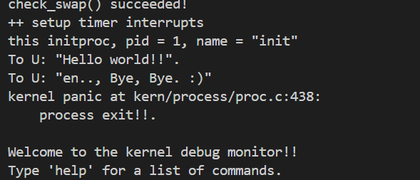
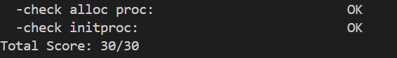

# lab4实验报告
李欣龙 赵思洋 闫耀方
--- 
### 练习0：填写已有实验

> 本实验依赖实验2/3。请把你做的实验2/3的代码填入本实验中代码中有“LAB2”,“LAB3”的注释相应部分。

### 练习1：分配并初始化一个进程控制块（需要编码）

> alloc_proc函数（位于kern/process/proc.c中）负责分配并返回一个新的struct proc_struct结构，用于存储新建立的内核线程的管理信息。ucore需要对这个结构进行最基本的初始化，你需要完成这个初始化过程。
>
> 【提示】在alloc_proc函数的实现中，需要初始化的proc_struct结构中的成员变量至少包括：state/pid/runs/kstack/need_resched/parent/mm/context/tf/cr3/flags/name。
>
> 请在实验报告中简要说明你的设计实现过程。

只需初始化proc_struct结构体的成员变量即可，具体设计实现如下：

```C++
static struct proc_struct *alloc_proc(void)
{
    struct proc_struct *proc = kmalloc(sizeof(struct proc_struct));
    if (proc != NULL)
    {
        proc->state = PROC_UNINIT;// 设置进程为“未初始化”状态——即第0个内核线程（空闲进程idleproc）
        proc->pid = -1;  // 设置进程PID为未初始化值，即-1
        proc->runs = 0;// 根据提示可知该成员变量表示进程的运行时间，初始化为0
        proc->kstack = 0; // 进程内核栈初始化为空【kstack记录了分配给该进程/线程的内核栈的位置】
        proc->need_resched = 0;// 是否需要重新调度以释放 CPU？当然了，我们现在处于未初始化状态，不需要进行调度
        proc->parent = NULL; // 父进程控制块指针，第0个进程控制块
        proc->mm = NULL;// 进程的内存管理字段:参见lab3练习一分析；对于内核进程而言，不存在虚拟内存管理
        memset(&(proc->context), 0, sizeof(struct context));
        proc->tf = NULL;// 进程中断帧，初始化为空，发生中断时修改
        proc->cr3 = boot_cr3;// 页表基址初始化——在pmm_init中初始化页表基址，实际上是satp寄存器
        proc->flags = 0;// 进程标志位，初始化为空
        memset(proc->name, 0, PROC_NAME_LEN);// 进程名初始化为空
    }
    return proc;
}
```

> 请回答如下问题：
>
> - 请说明proc_struct中`struct context context`和`struct trapframe *tf`成员变量含义和在本实验中的作用是啥？（提示通过看代码和编程调试可以判断出来）

`struct context context`: 根据`kern/process/proc.h`中对于结构体`context`的定义，可以知道这个结构体存储进程执行上下文的信息，即一些关键寄存器的信息，包括函数返回地址（ra）、栈指针（sp）以及寄存器s0到s11的值。这些寄存器的值用于在进程切换中还原之前进程的运行状态，从而能够使得`CPU`在不同进程间进行切换，达到分时复用的效果。

`struct trapframe *tf`: 根据`kern/trap/trap.h`中对于`trapframe`的定义，可以知道这个结构体可以用于在中断或异常处理程序中保存和恢复处理器状态的信息。它包含了通用寄存器的值（通过结构体pushregs gpr）、处理器状态（status）、异常指令的地址（epc）、异常值（tval）以及异常原因（cause）。

在本实验中，调用switch_to后，idle线程的context存储到栈上，将init的栈上的context加载到寄存器中。然后，switch_to末尾的ret指令会使进程返回到context中的ra寄存器存储的地址，而ra存储的是forkret，forkrets又会跳转到__trapret，__trapret末尾的sret会返回到epc寄存器存储的地址，而epc寄存器通过tf设置成了kernel_thread_entry，kernel_thread_entry内部会跳转到context中的s0存储的地址，s0存储的是init_main，完成线程切换。总的来说，本次实验通过context和tf的存储的信息相互配合，最终完成了内核线程的切换。

### 练习2：为新创建的内核线程分配资源（需要编码）

> 创建一个内核线程需要分配和设置好很多资源。kernel_thread函数通过调用**do_fork**函数完成具体内核线程的创建工作。do_kernel函数会调用alloc_proc函数来分配并初始化一个进程控制块，但alloc_proc只是找到了一小块内存用以记录进程的必要信息，并没有实际分配这些资源。ucore一般通过do_fork实际创建新的内核线程。do_fork的作用是，创建当前内核线程的一个副本，它们的执行上下文、代码、数据都一样，但是存储位置不同。因此，我们**实际需要"fork"的东西就是stack和trapframe**。在这个过程中，需要给新内核线程分配资源，并且复制原进程的状态。你需要完成在kern/process/proc.c中的do_fork函数中的处理过程。它的大致执行步骤包括：

> - 调用alloc_proc，首先获得一块用户信息块。
> - 为进程分配一个内核栈。
> - 复制原进程的内存管理信息到新进程（但内核线程不必做此事）
> - 复制原进程上下文到新进程
> - 将新进程添加到进程列表
> - 唤醒新进程
> - 返回新进程号
>
> 请在实验报告中简要说明你的设计实现过程。

1. **进程控制块分配**：  
   -  调用 `alloc_proc()` 分配进程控制块，失败返回 `-E_NO_FREE_PROC`
2. **内核栈分配**：  
   -  调用 `setup_kstack()` 分配内核栈，失败则释放进程控制块
3. **复制进程内存信息**：  
   -  调用 `copy_mm()` 处理内存管理结构，对内核线程，直接返回 0
4. **复制父进程上下文**：  
   -  调用 `copy_thread()` 设置新进程的 `trapframe` 和上下文，设置入口函数、栈指针等
5. **进程注册**：  
   -  获取 `PID`，将进程加入 `hash_list` 和 `proc_list`，原子操作确保安全
6. **激活进程**：  
   -  调用 `wakeup_proc()` 将进程设置为就绪状态

```C++
int do_fork(uint32_t clone_flags, uintptr_t stack, struct trapframe *tf){
    int ret = -E_NO_FREE_PROC;
    struct proc_struct *proc;
    if (nr_process >= MAX_PROCESS){
        goto fork_out;
    }
    ret = -E_NO_MEM;
    // 1. 调用 alloc_proc 分配一个进程控制块
    if ((proc = alloc_proc()) == NULL){
        goto fork_out;
    }
    // 2. 调用 setup_kstack 为进程分配一个内核栈
    if (setup_kstack(proc) != 0){
        goto bad_fork_cleanup_proc;
    }

    // 3. 调用 copy_mm 根据 clone_flags 复制或共享内存管理信息
    if (copy_mm(clone_flags, proc) != 0){
        goto bad_fork_cleanup_kstack;
    }
    // 4. 调用 copy_thread 复制原进程的上下文信息
    copy_thread(proc, stack, tf);
    // 5. 将新进程插入到进程hash列表和进程列表中
    bool intr_flag;
    local_intr_save(intr_flag);{
        proc->pid = get_pid();
        hash_proc(proc);
        list_add(&proc_list, &(proc->list_link));
        nr_process++;
    }
    local_intr_restore(intr_flag);
    // 6. 将新进程设置为就绪状态
    wakeup_proc(proc);
    // 7. 返回新进程的pid
    ret = proc->pid;
fork_out:
    return ret;
bad_fork_cleanup_kstack:
    put_kstack(proc);
bad_fork_cleanup_proc:
    kfree(proc);
    goto fork_out;
}
```

> 请回答如下问题：
>
> - 请说明ucore是否做到给每个新fork的线程一个唯一的id？请说明你的分析和理由。

ucore 通过 get_pid() 函数为每个新 fork 的线程分配唯一的 id。通过分析代码实现可以看出，该机制是可靠的。

get_pid() 函数使用两个静态变量：last_pid 用于记录上次分配的 PID，next_safe 用于记录可能产生冲突的下一个 PID。当需要分配新 PID 时，函数会首先递增 last_pid，如果超过最大值 MAX_PID 则重置为 1。为了确保 PID 的唯一性，函数会遍历当前所有进程，检查是否存在 PID 冲突。如果发现冲突，会继续递增 last_pid 直到找到一个未使用的 PID。

系统通过以下机制保证 PID 的唯一性：

1. 在 do_fork 函数中使用关中断操作，确保 PID 分配过程的原子性，避免并发分配产生相同的 PID
2. 使用 static_assert(MAX_PID > MAX_PROCESS) 确保 PID 的空间大于最大进程数
3. 采用进程列表和哈希表的双重管理机制，方便进程查找和唯一性检查
4. PID 在 1 到 MAX_PID 之间循环使用，保证了资源的合理利用

因此，ucore 的 PID 分配机制通过严格的分配策略和完善的检查机制，确保了每个新 fork 的线程都能获得唯一的标识符。

### 练习3：编写proc_run 函数（需要编码）

> proc_run用于将指定的进程切换到CPU上运行。它的大致执行步骤包括：
>
> - 检查要切换的进程是否与当前正在运行的进程相同，如果相同则不需要切换。
> - 禁用中断。你可以使用`/kern/sync/sync.h`中定义好的宏`local_intr_save(x)`和`local_intr_restore(x)`来实现关、开中断。
> - 切换当前进程为要运行的进程。
> - 切换页表，以便使用新进程的地址空间。`/libs/riscv.h`中提供了`lcr3(unsigned int cr3)`函数，可实现修改CR3寄存器值的功能。
> - 实现上下文切换。`/kern/process`中已经预先编写好了`switch.S`，其中定义了`switch_to()`函数。可实现两个进程的context切换。
> - 允许中断。
>
> 请回答如下问题：
>
> - 在本实验的执行过程中，创建且运行了几个内核线程？
>
> 完成代码编写后，编译并运行代码：make qemu
>
> 如果可以得到如 附录A所示的显示内容（仅供参考，不是标准答案输出），则基本正确。

在`kern/process/proc.c`的`void proc_init(void)`函数中创建并运行了两个进程，该函数在`kern/init/init.c`中被调用：

- idleproc：“继承了”ucore的运行，其执行主体为cpu_idle，该函数内部是一个死循环，只要need_resched设置为1，就调用schedule()要求调度器切换其他进程执行。
- initproc：这个子内核线程的工作就是输出一些字符串，然后就返回了

最终`make qemu`执行后的输出如下：



最终`make grade`执行后的输出如下：



### 扩展练习 Challenge：

> - 说明语句`local_intr_save(intr_flag);....local_intr_restore(intr_flag);`是如何实现开关中断的？

在`local_intr_restore(intr_flag)`调用之后，中断恢复到之前的状态。如果之前是允许中断的（`intr_flag`为真），那么现在可以正常响应中断；如果之前是禁止中断的（`intr_flag`为假），那么中断依然是禁止的。

local_intr_save(x)宏调用__intr_save()函数，读取sstatus寄存器，判断SSTATUS_SIE位为0还是1。如果是1，则调用intr_disable()关闭中断，返回1；否则，直接返回0。函数的返回值存储在x中。intr_disable()内部是通过将SSTATUS_SIE置0来实现关闭中断。

local_intr_restore(x)宏调用__intr_restore()函数，如果x为1，则调用intr_enable()开启中断。intr_enable()内部是通过将SSTATUS_SIE置1来实现开启中断。

总之，通过local_intr_save(intr_flag)保存中断状态，再通过local_intr_restore(intr_flag)恢复中断状态，从而实现开关中断。
