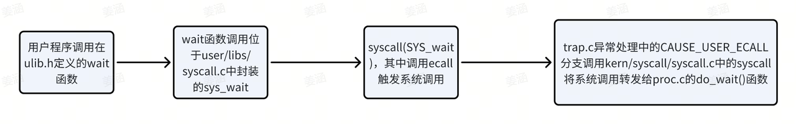

# Lab5 实验报告
李欣龙 赵思洋 闫耀方

### 练习0：填写已有实验
> 本实验依赖实验2/3/4。请把你做的实验2/3/4的代码填入本实验中代码中有“LAB2”/“LAB3”/“LAB4”的注释相应部分。注意：为了能够正确执行lab5的测试应用程序，可能需对已完成的实验2/3/4的代码进行进一步改进。


### 练习1: 加载应用程序并执行（需要编码）
> do_execv函数调用load_icode（位于kern/process/proc.c中）来加载并解析一个处于内存中的ELF执行文件格式的应用程序。你需要补充load_icode的第6步，建立相应的用户内存空间来放置应用程序的代码段、数据段等，且要设置好proc_struct结构中的成员变量trapframe中的内容，确保在执行此进程后，能够从应用程序设定的起始执行地址开始执行。需设置正确的trapframe内容。

>请在实验报告中简要说明你的设计实现过程。

在本部分中，我们需要完成的是load_icode中的第六步，而该函数被do_execv调用，把新的程序加载到当前进程里（程序已经存在于内存空间中），给用户进程建立一个能够正常运行的用户环境，涉及页表、用户栈等。
```c
//(6) setup trapframe for user environment
struct trapframe *tf = current->tf;
// Keep sstatus
uintptr_t sstatus = tf->status;
memset(tf, 0, sizeof(struct trapframe));
/* LAB5:EXERCISE1 YOUR CODE
    * should set tf->gpr.sp, tf->epc, tf->status
    * NOTICE: If we set trapframe correctly, then the user level process can return to USER MODE from kernel. So
    *          tf->gpr.sp should be user stack top (the value of sp)
    *          tf->epc should be entry point of user program (the value of sepc)
    *          tf->status should be appropriate for user program (the value of sstatus)
    *          hint: check meaning of SPP, SPIE in SSTATUS, use them by SSTATUS_SPP, SSTATUS_SPIE(defined in risv.h)
    */
tf->gpr.sp = USTACKTOP; // 设置f->gpr.sp为用户栈的顶部地址
tf->epc = elf->e_entry; // 设置tf->epc为用户程序的入口地址
tf->status = (read_csr(sstatus) & ~SSTATUS_SPP & ~SSTATUS_SPIE); // 根据需要设置 tf->status 的值，清除 SSTATUS_SPP 和 SSTATUS_SPIE 位

ret = 0;
```
>请简要描述这个用户态进程被ucore选择占用CPU执行（RUNNING态）到具体执行应用程序第一条指令的整个经过。

- 用户进程userproc的创建过程如下
  - 在proc_init中创建内核线程initproc时，用到了kernel_thread(init_main, NULL, 0); 调用init_main。
  - 在init_main 中，用到语句为kernel_thread(user_main, NULL, 0); 调用user_main。
  - 在user_main中，用到 KERNEL_EXECVE2(TEST, TESTSTART, TESTSIZE);这条语句调用了kernel_execve函数，用于加载并执行一个新的程序，这个函数内调用了SYS_exec命令。结合实验指导书，我们可知第一个用户进程是由第二个内核线程initproc通过把hello应用程序执行码覆盖到initproc的用户虚拟内存空间来创建的。参数TEST为进程名，TESTSTART和TESTSIZE分别为执行码的起始位置和执行码的大小。kernel_execve 把这两个变量作为 SYS_exec 系统调用的参数，让 ucore 来创建此用户进程。
  - 当 ucore 收到此系统调用后，将依次调用如下函数：vector128(vectors.S)-->__alltraps(trapentry.S)-->trap(trap.c)-->trap_dispatch(trap.c)--->syscall(syscall.c)-->sys_exec(syscall.c) -->do_execve(proc.c)。do_execve函数的作用在指导书中有详细说明。
  >   - do_execve函数来完成用户进程的创建工作，将用户态程序加载到内核态。此函数的主要工作流程如下：
  >     - 首先为加载新的执行码做好用户态内存空间清空准备。如果mm不为NULL，则设置页表为内核空间页表，且进一步判断mm的引用计数减1后是否为0，如果为0，则表明没有进程再需要此进程所占用的内存空间，为此将根据mm中的记录，释放进程所占用户空间内存和进程页表本身所占空间。最后把当前进程的mm内存管理指针为空。由于此处的initproc是内核线程，所以mm为NULL，整个处理都不会做。
  >     - 接下来的一步是加载应用程序执行码到当前进程的新创建的用户态虚拟空间中。这里涉及到读ELF格式的文件，申请内存空间，建立用户态虚存空间，加载应用程序执行码等。load_icode函数完成了整个复杂的工作。
  - 在load_icode中，我们完成了对用户线程内存空间的初始化，堆栈的设置，并将 ELF 可执行文件进行了加载。（加载这一步，子进程还没创建！）随后，通过current->tf修改了当前的 trapframe，使得中断返回的时候能够切换到用户态，并且可以正确地将控制权转移到应用程序的入口。
  - 当上述工作结束之后，kernel_thread函数内调用了do_fork。do_fork内调用wake_proc完成进程创建，并让进程处于就绪状态（RUNNABLE），等待调度执行。
- initproc在创建用户进程后调用do_wait函数，等待就绪状态（RUNNABLE）的子进程出现进行调度，调用schedule函数。
- schedule函数被激活后调用proc_run函数运行新的进程：
    - 将satp寄存器设置为用户态进程的页表基址（lcr3(to->cr3)）
  - 调用swtich_to函数进行上下文切换，保存当前寄存器状态，恢复待执行进程的寄存器状态
  - 使用ret指令跳转到ra寄存器指向的地址处继续执行（事实上，在do_fork函数内，我们调用了copy_thread函数，将该寄存器指向了forkret。因此我们在切换上下文之后，会跳转到forkret函数中）
- forkret函数会调用forkrets(trapentry.S)，从这里跳转到__trapret，转而保存所有的寄存器，即调用宏RESTORE_ALL。此时由于我们已经在在 load_icode 将 SSTATUS_SPP 设置为 0，因此不执行跳转，保存内核态栈指针，恢复 sstatus 和 sepc 以及通用寄存器，然后执行 sret 指令回到用户态。
- 跳转到 sepc 指向的地址处，即 ELF 文件的入口地址，从而执行用户态程序。

### 练习2: 父进程复制自己的内存空间给子进程（需要编码）
####  请补充copy_range的实现，简要说明设计实现过程。
> 在 uCore 操作系统中，创建子进程的 `do_fork` 函数需要实现一个核心功能，即复制当前进程（父进程）的用户内存地址空间到新进程（子进程），以便子进程能够从父进程复制所有有效的用户空间内存内容。这个操作实际上是复制父进程的内存映射，并将这些映射应用于子进程，使得子进程拥有与父进程相同的内存内容。


##### 1. `copy_range` 函数的作用

`copy_range` 函数的主要作用是复制父进程的用户空间内存到子进程，它通过以下步骤来完成任务：

1. **检查对齐和有效范围**：确保 `start` 和 `end` 地址都是页对齐的，并且处于用户空间的有效地址范围内。
2. **遍历每一页**：根据 `start` 和 `end` 的范围，按页遍历父进程的地址空间。
3. **查找父进程的页表项**：通过 `get_pte` 函数获取父进程中对应虚拟地址 `start` 的页表项（PTE）。
4. **查找子进程的页表项**：如果父进程的页表项有效（即 PTE 中的有效位 `PTE_V` 被设置），则查找子进程相同虚拟地址的页表项。如果子进程的页表项不存在，则分配一个新的页表项。
5. **复制内存内容**：找到父进程页面后，分配一个新的页面给子进程，并将父进程页面的内容复制到子进程的页面中。
6. **建立映射关系**：使用 `page_insert` 函数将复制后的新页面映射到子进程的虚拟地址空间。

##### 2. `do_fork` 的实现

`do_fork` 函数是用来创建子进程的，具体实现过程中需要将父进程的用户空间内存内容复制到子进程。它会调用 `copy_range` 来完成内存复制的工作。`do_fork` 的基本步骤如下：

1. **创建新的进程**：首先为子进程分配进程结构 `struct proc_struct`，并初始化相关信息（如进程 ID、父进程指针、状态等）。
2. **复制父进程的资源**：复制父进程的资源，包括文件描述符、信号等。对于内存资源，则调用 `copy_mm` 函数来复制父进程的内存管理结构。
3. **调用 `copy_mm`**：`copy_mm` 函数负责复制父进程的内存空间到子进程，它会调用 `dup_mmap`，后者会调用 `copy_range` 来复制内存页内容。
4. **执行内存复制**：`copy_range` 会按页复制父进程的内存到子进程，并建立页表映射。

##### 3. `do_fork` 中如何调用 `copy_range`

```c
int do_fork(struct proc_struct *parent) {
    struct proc_struct *child;
    int ret;

    // 创建一个新的进程
    child = alloc_proc();
    if (child == NULL) {
        return -E_NO_MEM;
    }

    // 复制父进程的进程资源
    child->parent = parent;
    child->pid = alloc_pid();
    child->state = PROC_RUNNING;

    // 复制父进程的内存空间
    ret = copy_mm(child);
    if (ret != 0) {
        return ret;
    }

    // 设置调度器
    schedule();

    return 0;
}
```

##### 4. `copy_mm` 和 `dup_mmap`

`copy_mm` 函数是负责复制父进程的内存管理结构，并在新进程（子进程）中创建一个新的页表。`dup_mmap` 函数则负责遍历父进程的内存区域，并调用 `copy_range` 来复制具体的内存页内容。

```c
int copy_mm(struct proc_struct *child) {
    int ret;

    // 复制父进程的页表
    ret = dup_mmap(child);
    if (ret != 0) {
        return ret;
    }

    return 0;
}

int dup_mmap(struct proc_struct *child) {
    // 调用 copy_range 来复制父进程的内存
    return copy_range(child->mm->pgdir, current->mm->pgdir, USER_START, USER_END, false);
}
```

在 `dup_mmap` 中，`copy_range` 被用来按页复制父进程的内存内容到子进程中。

##### 5. `copy_range` 中复制的具体过程

1. **父进程的页表项 `ptep`**：通过 `get_pte` 函数查找父进程虚拟地址对应的页表项。
2. **子进程的页表项 `nptep`**：为子进程分配一个新的页表项，并将父进程的页表项复制到新的页表中。
3. **内存复制**：调用 `memcpy` 函数将父进程的页面内容复制到子进程的页面。
4. **建立页表映射**：通过 `page_insert` 函数将复制的页面映射到子进程的页表中。

##### 6. 总结

`do_fork` 函数的目的是通过复制父进程的用户空间内存，创建一个新的子进程。它通过调用 `copy_mm` 和 `dup_mmap`，进而调用 `copy_range` 函数，按页复制父进程的内存内容到子进程。这些操作确保了子进程在启动时能够拥有与父进程相同的内存内容，从而能够正确执行。

#### 问题：如何设计实现Copy on Write机制？给出概要设计，鼓励给出详细设计。
> Copy-on-Write（COW）机制的核心思想是延迟拷贝：当多个进程共享同一块资源（如内存页）时，如果没有进程对该资源进行修改，则它们共享同一份资源。当有进程需要修改该资源时，操作系统会在此时拷贝资源，从而给修改的进程提供一个独立的副本，而不影响其他进程对资源的访问。COW主要用于优化内存使用，尤其是在进程复制时，例如在 `fork` 系统调用中。

下面是 COW 机制的概要设计和详细设计。

##### 1. **概要设计**

1.1 **基本流程**

- **共享资源**：父进程和子进程共享相同的资源（如内存页、文件描述符等）。在进程创建时（如调用 `fork`），父子进程的资源都指向同一个物理页面。
- **写时拷贝**：当某个进程尝试修改共享的资源时，操作系统会检测到该资源的写访问，并在此时创建该资源的一个副本供该进程使用。此时，进程对该资源的修改只会影响自己的副本，而不会影响其他进程。
- **资源保护**：通过标记资源为只读，并且当发生写操作时触发页异常（Page Fault），操作系统进行拷贝操作，之后将进程的虚拟页表指向新的副本。

 1.2 **实现的关键点**

- **页表标记**：进程的页表项需要设置为只读，并在发生写操作时触发页异常。
- **拷贝操作**：当写操作发生时，操作系统会为进程分配一个新的物理页面，并将原页面的内容复制到新的物理页面。
- **共享机制**：父进程和子进程的内存页指向同一物理页面，直到发生写操作时才进行复制。
- **释放策略**：在内存不再需要时，资源的释放需要考虑是否是共享的页面，避免不必要的内存拷贝。

##### 2. **详细设计**

2.1 **数据结构设计**

- **页表项**（`ptep_t`）：每个进程都有自己的页表，`ptep_t` 是页表项的数据结构。COW 需要在页表项中增加一个标志位 `PTE_COW`，表示该页是共享的，可以被拷贝。
- **进程控制块（PCB）**：在进程控制块中保存当前进程的内存管理信息，包括指向页表的指针等。
- **内存管理结构（`mm_struct`）**：每个进程有一个内存管理结构，其中包含了该进程的页表、页目录等信息。

2.2 **实现步骤**

    1. **修改页表**：
       - 在 `fork` 系统调用时，父进程的所有用户内存页面会被标记为共享（即标记 `PTE_COW`）。子进程会继承父进程的页表项，但也会将这些页面标记为 `PTE_COW`，表示共享内存。
       - 在写时操作（如 `write` 系统调用）之前，页表中的每个共享页都应设置为只读。当进程尝试写入这些页时，操作系统会触发页面缺失异常。
    
    2. **处理页面缺失**：
       - 如果进程对一个共享页进行写操作，操作系统会捕捉到该页的页面缺失异常（`Page Fault`）。
       - 操作系统会检查该页面的页表项，判断该页是否被标记为 `PTE_COW`。如果是，则触发 COW 机制，操作系统为进程分配一个新的页面，并将原始页面的内容复制到新页面中。
       - 然后，将新页面的页表项更新为可写，并指向新的物理页面。
    
    3. **内存复制（写时拷贝）**：
       - 操作系统通过 `memcpy` 或类似的函数将原始页面的内容复制到新页面中。
       - 更新进程的页表，使得进程的虚拟地址空间指向新分配的页面，并将新页面的权限设置为可写。
    
    4. **管理资源释放**：
       - 在进程退出时，操作系统需要检查该进程的所有页面，判断哪些是共享的 COW 页面，只有当没有其他进程引用这些页面时，才会释放页面的物理内存。
       - 可以使用引用计数来管理共享页面的释放。
    
    5. **对内存页的访问控制**：
       - 对于标记为 `PTE_COW` 的页面，操作系统在进行写操作时需要处理页面缺失异常。
       - 如果进程试图读取该页，操作系统无需做任何处理，直接返回原页面内容；但如果进程写入该页，操作系统必须拷贝该页并更新相应的映射。

2.3 **主要函数和模块**

- **`do_fork`**：在 `fork` 调用时，父子进程共享内存页并标记为 COW。子进程继承父进程的页表。
- **`page_fault_handler`**：处理页面缺失异常。当进程对 COW 页执行写操作时，会调用此函数。它负责复制页内容并更新页表。
- **`copy_page`**：执行内存拷贝，将父进程的页面内容复制到新分配的页面。

##### 3. **实现示例**

```c
// 页表项的 PTE_COW 标记
#define PTE_COW 0x800

// 页表项标志处理
#define PTE_FLAGS(pte) ((pte) & 0xFFF)
#define PTE_IS_COW(pte) (PTE_FLAGS(pte) & PTE_COW)

// 在 `fork` 时创建子进程的 COW 页面
int do_fork(struct proc_struct *parent) {
    struct proc_struct *child;
    int ret;

    // 分配新进程
    child = alloc_proc();
    if (child == NULL) {
        return -E_NO_MEM;
    }

    // 复制父进程的资源
    child->parent = parent;
    child->pid = alloc_pid();
    child->state = PROC_RUNNING;

    // 复制内存管理结构
    ret = copy_mm(child);
    if (ret != 0) {
        return ret;
    }

    // 设置父子进程的页表项为 COW
    ret = set_cow_pages(child->mm->pgdir);
    if (ret != 0) {
        return ret;
    }

    // 执行调度
    schedule();

    return 0;
}

// 处理 COW 页面缺失异常
void page_fault_handler(struct trapframe *tf) {
    // 获取触发异常的虚拟地址
    uintptr_t fault_addr = tf->cause;

    // 查找该地址的页表项
    pte_t *pte = get_pte(current->mm->pgdir, fault_addr, 0);
    if (pte == NULL || !PTE_IS_COW(*pte)) {
        // 如果不是 COW 页，直接处理其他页面缺失
        handle_page_fault(tf);
        return;
    }

    // 为该页分配新页面
    struct Page *new_page = alloc_page();
    assert(new_page != NULL);

    // 将旧页面内容复制到新页面
    memcpy(page2kva(new_page), page2kva(pte2page(*pte)), PGSIZE);

    // 更新页表，指向新页面，并设置可写
    page_insert(current->mm->pgdir, new_page, fault_addr, PTE_W | PTE_U);

    // 清除 COW 标志
    *pte &= ~PTE_COW;

    // 重新执行指令
    tf->epc += 4;
}
```

##### 4. **总结**

COW 机制能够显著提高内存使用效率，尤其是在进程复制时（如 `fork` 调用），避免了不必要的内存拷贝。通过延迟复制，只有在实际写操作发生时才进行拷贝，这样就减少了内存消耗和复制操作。COW 机制在操作系统中广泛应用，尤其是在虚拟内存管理中，是一种重要的性能优化手段。

### 练习3: 阅读分析源代码，理解进程执行 fork/exec/wait/exit 的实现，以及系统调用的实现（不需要编码）
>请在实验报告中简要说明你对 fork/exec/wait/exit函数的分析。并回答如下问题：
> - 请分析fork/exec/wait/exit的执行流程。重点关注哪些操作是在用户态完成，哪些是在内核态完成？内核态与用户态程序是如何交错执行的？内核态执行结果是如何返回给用户程序的？

函数分析

**Fork**

- 从已存在进程中创建一个新进程。新进程为子进程，而原进程为父进程。 
- 调用过程如图：

可以看到当程序执行`fork`，`fork`使用了系统调用`SYS_fork`，然后系统调用被转发给`do_fork`函数创建子进程。其具体分析如下所示：
1. 检查系统资源是否足够

    首先，函数检查当前系统中是否已经达到最大进程数。如果当前进程数已经达到系统限制，它会直接返回一个错误代码，结束进程创建过程。这一步确保系统不会创建超过最大允许数目的进程，从而避免资源耗尽。
2. 分配进程控制块

    接着，函数会为新进程分配一个进程控制块（PCB）。进程控制块是每个进程的管理结构，它包含了进程的各种信息，如状态、父进程指针、内存信息等。如果分配失败，函数会立即返回错误。
3. 分配内核栈

    每个进程在内核态运行时都需要一个内核栈。函数为新进程分配内核栈，并检查是否分配成功。如果分配失败，它会清理已分配的资源并返回错误。
4. 内存复制或共享

    在大多数操作系统中，子进程通常需要继承父进程的内存内容。`do_fork` 函数通过 `copy_mm` 函数来复制或共享父进程的内存空间。具体行为取决于 `clone_flags`，该参数决定了内存是否应完全复制，还是部分共享。
5. 设置进程线程上下文

    为了使新进程能够从正确的地方开始执行，函数会设置新进程的线程上下文。线程上下文包括执行状态、栈指针等信息。`copy_thread` 函数将父进程的线程状态（如寄存器值、栈等）复制到子进程的上下文中，确保新进程从正确的地方恢复执行。
6. 分配进程 ID（PID）

    每个进程都需要一个唯一的 PID。`do_fork `函数通过调用 `get_pid` 为新进程分配一个唯一的 PID。PID 是进程在系统中的唯一标识符，它用于进程管理和调度。新进程的父进程指针也会被设置为当前进程。
7. 唤醒新进程

    一旦子进程的资源和状态设置完毕，函数会通过 `wakeup_proc` 将新进程的状态标记为可调度状态，表明它已经准备好运行，并可以在调度器中被调度执行。
8. 错误处理和资源清理

    如果在创建进程的任何步骤中出现错误，函数会采取相应的错误处理措施。这包括清理已经分配的资源，如进程控制块、内核栈等，确保系统处于一致状态。这样即使在进程创建过程中出现了问题，也不会导致内存泄漏或其他问题。
9. 返回新进程的 PID

    最终，`do_fork` 函数会返回新创建的子进程的 PID，作为函数的结果。

**exec**

- 在当前的进程下，停止原先正在运行的程序，开始执行一个新程序。
- 调用过程：

由上面的调用过程可知,应用程序执行的时候，会调用`SYS_exec`系统调用，然后系统调用被转发给`do_execve`函数完成用户进程的创建工作(加载一个新的可执行程序并替换当前进程的地址空间)。
`do_execve`主要实现：
    -  (1)为加载新的执行码做好用户态内存空间清空准备；
    - (2)加载应用程序执行码到当前进程新创建的用户虚拟空间中。
其具体分析如下所示：
1. 检查可执行程序名称的有效性

    函数首先检查传递给它的程序名是否在当前进程的用户内存中可访问。通过调用 `user_mem_check` 函数，确保传入的程序名称指针是有效的并且位于用户可访问的内存范围。如果无法访问该内存，函数返回` -E_INVAL`，表示无效的程序名。
2. 处理程序名的长度

    接着，函数检查程序名的长度是否超出预设的最大长度 `PROC_NAME_LEN`。如果程序名的长度超出最大值，函数将其截断为 `PROC_NAME_LEN`。这一步避免了程序名过长可能导致的缓冲区溢出问题。
3. 存储可执行程序名称

    程序名存储到`local_name`中。
4. 清理当前进程的内存空间

    如果当前进程已经分配了内存管理结构（即` current->mm `不为 `NULL`），函数会开始清理工作。首先，它将进程的页表切换回启动时的页表（`lcr3(boot_cr3)`），这是为了避免在修改当前进程的内存空间时对系统产生影响。如果进程的内存管理结构引用计数为 0，意味着没有其他进程共享该内存空间，那么该进程的虚拟内存需要被销毁。函数通过` mm_count_dec` 减少引用计数，并在必要时清理该进程的内存空间，包括释放页表、内存映射等。
5. 加载新的可执行文件

    在清理完当前进程的内存空间后，函数调用` load_icode `来加载新的可执行文件。如果加载失败，函数会跳转到 `execve_exit `标签，进行错误处理和资源清理。此时，新程序的二进制内容被加载到内存中，并准备替换当前进程的映像。
6. 设置进程名称

    如果程序成功加载，函数会使用 `set_proc_name` 设置当前进程的名称为新程序的名称。这意味着进程的名称将反映其新执行的程序，而不再是之前的名称。
7.  退出当前进程

    如果在加载新程序时发生错误，或者加载成功后，`do_execve` 函数会通过调用 `do_exit` 来结束当前进程的生命周期。无论成功还是失败，都会进行适当的资源清理和内存释放。

**wait**
- 挂起当前的进程，等到特定条件满足的时候再继续执行
- 调用过程：


由上面的调用过程可以看到，当程序执行wait，wait使用了系统调用SYS_wait，然后系统调用被转发给do_wait函数，等待子进程退出。

do_wait函数主要完成父进程对子进程的最后回收工作。它主要是循环检查子进程，检查指定 PID 的子进程或遍历当前进程的所有子进程(`pid==0`的情况)，如果找到了子进程就判断其执行状态是否为`PROC_ZOMBIE`：

若不为`PROC_ZOMBIE`说明该子进程还未退出，则将当前进程状态设置为等待，等待子进程退出，同时调用调度器将 CPU 时间片分配给其他可运行的进程，继续循环。

若为`PROC_ZOMBIE`，说明该子进程处于退出状态，则检查进程的合法性、获取退出码并处理进程退出关闭中断，移除子进程的哈希表项和链接、释放子进程内核栈和进程结构，完成子进程的回收工作。其具体分析如下所示：
1. 检查退出码存储地址的合法性

    函数首先检查传入的 `code_store`（用于存储子进程退出码的地址）是否为空。如果不为空，系统会验证该地址是否在合法的用户内存区域内。此检查确保用户空间的地址不会超出当前进程可访问的内存范围，从而避免访问无效或非法内存导致的崩溃。

2. 遍历和检查子进程

    函数通过两种方式遍历子进程并查找是否有已退出的子进程：
- 指定子进程的情况：如果用户指定了 `pid`，函数通过 `find_proc` 查找该进程 `ID` 对应的子进程。如果找到的进程是当前进程的子进程，并且状态是“僵尸”状态（即进程已经退出，但父进程还未回收资源），则会进一步处理该子进程。
- 未指定子进程的情况：如果 `pid` 为 0，函数遍历当前进程的所有子进程。此时，如果找到任何一个“僵尸”状态的子进程，就进入相应的处理逻辑。
3. 等待子进程退出

    如果当前进程有子进程并且存在处于“僵尸”状态的子进程，父进程会等待该子进程退出。如果没有找到“僵尸”子进程，父进程将进入睡眠状态，并将 `wait_state` 设置为 `WT_CHILD`（等待子进程状态）。在进入睡眠后，调度器会调度其他进程执行。当子进程退出或符合条件时，父进程会被唤醒并继续执行。如果当前进程的标志位为 `PF_EXITING`（表示该进程正在退出），父进程将会调用 `do_exit` 来退出。

4. 处理找到的僵尸子进程

    当找到一个“僵尸”状态的子进程后，系统首先检查该子进程是否是空闲进程（`idleproc`）或初始化进程（`initproc`）。如果是这两者中的任何一个，函数会触发 panic，这是因为空闲进程和初始化进程是特殊进程，不能作为子进程处理。
    如果子进程合法，系统会检查是否需要将子进程的退出码保存到用户传递的 `code_store` 地址。如果 `code_store` 非空，子进程的退出码会被存储在该位置。

5. 清理子进程资源
- 解除哈希表和链表中的引用：子进程从进程哈希表中移除，并且其在父进程链表中的引用也会被删除。这样做确保该进程不会再被调度器引用或唤醒。
- 释放进程的内核栈和进程结构：通过释放内存，子进程占用的资源得以回收。
6. 返回处理结果

    如果成功回收了子进程并获取了退出码，函数将返回 `0`，表示操作成功。如果没有找到符合条件的子进程，函数将返回 `-E_BAD_PROC`，表示当前进程没有可回收的子进程。
**exit**
- 退出当前的进程
- 调用过程：


由上面的调用过程，当程序执行`exit`，`exit`使用了系统调用`SYS_exit`，然后系统调用被转发给`do_exit`函数，回收当前进程占用的大部分内存资源并通知父进程完成最后的回收工作。

do_exit函数的主要工作内容：

(1)调用`exit_mmap&putpgdir&mm_destroy`释放进程几乎所有的内存空间

(2)将进程的状态设置为`PROC_ZOMBIE`，然后调用`wakeup_PROC(父进程)`以请求父进程回收自身。

(3)调用调度程序以切换到其他进程。
其具体分析如下所示：
1. 特殊进程退出检查。

    首先，函数检查当前进程是否是 `idleproc`（空闲进程）或 `initproc`（初始化进程）。` idleproc` 是系统的空闲进程，通常在所有其他进程都处于睡眠状态时运行。它不应当退出，因为这会导致系统的崩溃。`initproc `是系统中的初始化进程，它是所有其他用户进程的祖先，通常是系统启动时创建的第一个用户进程。如果该进程退出，可能会导致系统无法继续运行。
2. 清理当前进程的内存管理结构。

    如果当前进程有内存管理结构（mm），即它正在使用虚拟内存，那么该部分会负责释放与该进程关联的内存资源。具体操作如下：
- 切换到内核页表（lcr3(boot_cr3)），以便进行内核空间操作。
- 通过 `mm_count_dec()` 减少内存管理结构的引用计数。如果计数减到 0，说明没有其他进程再引用该进程的内存，接下来会释放进程的内存资源。
- 调用 `exit_mmap() `清理内存映射，释放所有与该进程相关的虚拟内存资源。
- 调用 `put_pgdir() `释放进程的页目录，并通过` mm_destroy() `销毁进程的内存管理结构。
- 将当前进程的内存管理结构指针 `current->mm `置为 `NULL`，标记进程的内存已经被释放。
3. 设置进程为“僵尸”状态

    接下来，当前进程的状态被设置为 `PROC_ZOMBIE`，表示进程已经退出，但它的资源尚未完全被回收。
4. 处理父进程

    在进程退出之前，函数会检查当前进程的父进程（`current->parent`）是否处于等待子进程退出的状态。如果是，说明父进程正在等待当前进程退出，此时需要唤醒父进程，使其能够继续执行并回收当前进程的资源。
5. 处理子进程

    当前进程可能有多个子进程，在进程退出时，需要做一些处理：
- 遍历当前进程的所有子进程，将它们的父进程设置为 `initproc`，并将它们添加到 `initproc` 的子进程链表中。这样做的目的是将所有“孤儿进程”交给 `initproc` 来管理，避免它们成为“僵尸”状态。
- 如果某个子进程已经处于僵尸状态，系统会唤醒 `initproc`，让它进行子进程的回收操作。
6. 恢复中断并调用调度器

    在处理完父进程和子进程之后，系统会恢复中断，允许进程调度再次发生。随后，调用调度器` schedule() `选择新的进程执行。通常这时系统会选择其他进程来运行，而当前进程已完全退出。

**执行流程：**
- fork（创建新进程）:
  - 用户程序通过系统调用 fork 请求操作系统创建一个新的进程。
  - 在内核态，操作系统创建一个新的进程控制块（PCB）来保存新进程的信息，包括程序计数器、寄存器等。
  - 操作系统复制当前进程的地址空间（内存映像）到新的进程，但是新进程有一个独立的地址空间。
- exec（执行新程序）：
  - 用户程序通过系统调用 exec 请求操作系统执行一个新的程序。
  - 在内核态，操作系统加载新的程序到当前进程的地址空间，并更新相应的数据结构，例如进程控制块和页表。
  - 由于 exec 会替换当前进程的地址空间，原有的程序代码和数据将被新程序代替。
- wait（等待子进程结束）:
  - 用户程序通过系统调用 wait 请求操作系统等待子进程的终止。
  - 在内核态，操作系统暂停当前进程的执行，直到一个子进程结束。
  - 如果子进程已经终止，操作系统回收子进程的资源，并将相关信息传递给父进程。
- exit（终止进程）：
  - 用户程序通过系统调用 exit 请求操作系统终止当前进程。
  - 在内核态，操作系统释放进程占用的资源，关闭文件描述符等。
  - 操作系统更新父进程的相关信息，例如子进程的退出状态。
  - 如果父进程在等待子进程结束，wait 会返回子进程的退出状态。

内核态和用户态的交错执行是通过中断和系统调用来实现的。当需要进行系统调用或处理中断时，CPU从用户态切换到内核态。一旦内核态工作完成，CPU再次切换回用户态，继续执行用户程序。
返回给用户程序的结果通过寄存器传递。在syscall的内联汇编中，将返回值存储在 ret 中，传回用户程序：
```c
asm volatile (
    "ld a0, %1\n""ld a1, %2\n""ld a2, %3\n""ld a3, %4\n""ld a4, %5\n""ld a5, %6\n""ecall\n""sd a0, %0"//2.通过 sd 指令保存到指定内存地址中
    : "=m" (ret)//1.将返回值存储在 ret 中
    : "m"(num), "m"(a[0]), "m"(a[1]), "m"(a[2]), "m"(a[3]), "m"(a[4])
    :"memory");
```

> - 请给出ucore中一个用户态进程的执行状态生命周期图（包执行状态，执行状态之间的变换关系，以及产生变换的事件或函数调用）。（字符方式画即可）

**用户态进程的执行状态生命周期图：**


>
> 执行：make grade。如果所显示的应用程序检测都输出ok，则基本正确。（使用的是qemu-1.0.1）

`make grade` 运行结果如下所示：


### 扩展练习 Challenge

1. #### 实现 Copy on Write （COW）机制

    > 给出实现源码,测试用例和设计报告（包括在cow情况下的各种状态转换（类似有限状态自动机）的说明）。
    >
    > 这个扩展练习涉及到本实验和上一个实验“虚拟内存管理”。在ucore操作系统中，当一个用户父进程创建自己的子进程时，父进程会把其申请的用户空间设置为只读，子进程可共享父进程占用的用户内存空间中的页面（这就是一个共享的资源）。当其中任何一个进程修改此用户内存空间中的某页面时，ucore会通过page fault异常获知该操作，并完成拷贝内存页面，使得两个进程都有各自的内存页面。这样一个进程所做的修改不会被另外一个进程可见了。请在ucore中实现这样的COW机制。
    >
    > 由于COW实现比较复杂，容易引入bug，请参考 https://dirtycow.ninja/ 看看能否在ucore的COW实现中模拟这个错误和解决方案。需要有解释。
    >
    > 这是一个big challenge.

在练习2中已经对 COW 机制进行了详细的描述，在此不再赘述。
在本实验中需要修改`pmm.c`文件中的`copy_range`函数和`vmm.c`文件中的`do_pgfault`函数。
对`copy_range`函数修改如下：
当`share`标志为真时，通过调用两次 page_insert，将同一个物理页 page 映射到两个不同进程的虚拟地址空间，从而实现共享内存的目的。
```c
            if (share)
            {
                cprintf("Sharing the page 0x%x\n", page2kva(page));
                page_insert(from, page, start, perm & (~PTE_W));
                ret = page_insert(to, page, start, perm & (~PTE_W));
            }
            else//下面为COW机制修改前的代码
            {
                // 为进程B分配一个页
                struct Page *npage = alloc_page();
                assert(npage != NULL);
                // 1.找寻父进程的内核虚拟页地址
                uintptr_t src_kvaddr = page2kva(page);
                // 2.找寻子进程的内核虚拟页地址
                uintptr_t dst_kvaddr = page2kva(npage);
                // 3.复制父进程内容到子进程
                memcpy(dst_kvaddr, src_kvaddr, PGSIZE);
                // 4.建立物理地址与子进程的页地址起始位置的映射关系
                ret = page_insert(to, npage, start, perm);
            }
```
`do_pgfault`函数修改如下：
在`copy_range`函数中我们将一个物理页映射到两个不同的虚拟地址空间中，从而实现所有进程共享一个物理页，但此时每个进程都只有可读的权限。要写入的话，就会触发页错误（Page Fault）。
核心写实复制会判断是否是共享，若是共享则将将旧物理页的数据从内核虚拟地址 `kva_src `拷贝到新页的地址 `kva_dst`，若是只有一个进程独享，则直接修改当前页表项，授予写权限，无需拷贝。
```c
        struct Page *page = NULL;
        // 如果当前页错误的原因是写入了只读页面
        if (*ptep & PTE_V)
        {
            // 写时复制：复制一块内存给当前进程
            cprintf("COW: ptep 0x%x, pte 0x%x\n", ptep, *ptep);
            // 原先所使用的只读物理页
            page = pte2page(*ptep);
            // 如果该物理页面被多个进程引用
            if (page_ref(page) > 1)
            {
                // 释放当前PTE的引用并分配一个新物理页
                struct Page *newPage = pgdir_alloc_page(mm->pgdir, addr, perm);
                void *kva_src = page2kva(page);
                void *kva_dst = page2kva(newPage);
                // 拷贝数据
                memcpy(kva_dst, kva_src, PGSIZE);
            }
            // 如果该物理页面只被当前进程所引用,即page_ref等1
            else
            {
                // 则可以直接执行page_insert，保留当前物理页并重设其PTE权限。
                page_insert(mm->pgdir, page, addr, perm);
            }
        }
        else//下面为COW机制修改前的代码
        {
            if (swap_init_ok)
            {
                struct Page *page = NULL;
                int r = swap_in(mm, addr, &page);

                if (r != 0)
                {
                    cprintf("swap_in in do_pgfault failed\n");
                    goto failed;
                }
                r = page_insert(mm->pgdir, page, addr, perm); // 更新页表，插入新的页表项
                if (r != 0)
                {
                    goto failed;
                }
                swap_map_swappable(mm, addr, page, 1);
                // 标记这个页面将来是可以再换出的
                page->pra_vaddr = addr;
            }
            else
            {
                cprintf("no swap_init_ok but ptep is %x, failed\n", *ptep);
                goto failed;
            }
        }
```
最后还要将`vmm.c`文件中`dup_mmap`函数调用`copy_range`函数部分的参数 `share` 置为1，才能触发 COW 机制。
```c
        // share 设置为 0，表示不共享内存，只是单纯的复制。
        // bool share = 0;
        // cow机制下，设置为共享
        bool share = 1;
        if (copy_range(to->pgdir, from->pgdir, vma->vm_start, vma->vm_end, share) != 0)
        {
            return -E_NO_MEM;
        }
```
实现 COW 机制后，`make grade`运行结果如下所示：


实现 COW 机制后，`make qemu`部分运行结果如下所示：


2. ####  说明该用户程序是何时被预先加载到内存中的？与我们常用操作系统的加载有何区别，原因是什么？

   在 uCore 操作系统中，用户程序是通过 `execve` 系统调用加载到内存中的。具体过程如下：


   1. **加载时机**


    用户程序会在执行 `execve` 系统调用时被加载到内存中。`execve` 是一个由用户态发起的系统调用，通常由用户程序通过内联汇编或系统调用接口触发。以下是相关过程：

    - 用户进程通过 `execve` 请求内核执行新的程序。
    - 内核处理该请求时，会首先释放当前进程的资源（如虚拟内存空间、页目录等），然后将新的用户程序加载到当前进程的虚拟内存中。

   在内核代码中，`kernel_execve` 会触发 `syscall`，最终调用 `do_execve` 函数来完成新的程序的加载。程序二进制文件（`binary`）和相关的信息（如程序的路径名 `name`）会作为参数传递给内核。内核通过 `load_icode` 等函数，将用户程序的二进制代码加载到当前进程的内存中。

    2. #####  **与常用操作系统加载的区别**

    常见的操作系统（如 Linux、Windows 等）在加载用户程序时，通常使用更为复杂的加载机制，包括：

    - **内核加载程序**：操作系统内核会负责在用户请求时将程序从磁盘加载到内存。这通常涉及到读取 ELF 或 PE 格式的可执行文件，解析程序的头部信息，分配合适的内存空间，将程序的代码段、数据段等加载到进程的虚拟内存空间。
    - **程序分配内存**：操作系统会分配合适的虚拟内存空间给用户程序，支持动态链接库（DLL）或共享库（shared libraries）的加载，并且可能使用分页机制来按需加载程序的不同部分（如 Linux 的 `demand paging`）。
    - **原因**：uCore 是一个简化的教学操作系统，还未实现文件系统功能和磁盘管理，所以只能采用这种方式模拟用户程序的加载。
